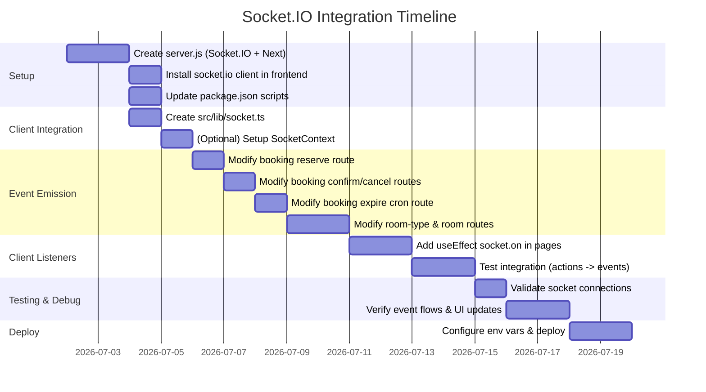

# Executive Summary

We have a Next.js “hotel-booking” full-stack project (App Router, Prisma DB, no separate Express backend). We need to **add live, real-time updates using Socket.IO**. This involves setting up a Socket.IO server and integrating it with the Next.js app, then emitting and listening for events at appropriate points. Key tasks include:

- **Socket.IO Server Setup**: Add a custom Node server (e.g. `server.js`) to launch Next and Socket.IO together. This requires editing `package.json` scripts (replace `next dev` with `node server.js`) and handling CORS if needed. Alternatively, we could run a separate Express server with `Server()` and configure proxies or CORS to connect with the Next frontend.
- **Client Integration**: Create a client socket module (e.g. `src/lib/socket.ts`) marked `"use client"`. Use `socket.io-client` to connect (e.g. `export const socket = io(<URL>)`). Wrap this in a React context/provider or custom hook for use across components.
- **Event Design**: Define events such as `bookingCreated`, `bookingConfirmed`, `bookingCancelled`, `bookingExpired`, `roomCreated`, `roomUpdated`, etc. We will establish a table of event names and payload schemas (e.g. `{bookingReference, bookingId, status, hotelId, userId, ...}`) based on use cases. For example, after a new booking reservation we might emit `{ bookingReference, bookingId, status, hotelId, userId, totalPrice, checkIn, checkOut }`.
- **Server Emits**: Insert `io.emit(...)` calls at strategic points in server-side code (Next API routes) after DB changes. For example, after a successful booking (`/api/bookings/reserve`), we emit `bookingCreated`; after confirmation (`/api/bookings/[ref]/confirm`), emit `bookingConfirmed`; after cancel or expire, emit `bookingCancelled` or `bookingExpired`. We may attach the `io` instance to the global object (e.g. `global.io = io` in `server.js`) so Next routes can call `global.io.emit(...)` when they run.
- **Client Listeners**: In React components/pages that display booking or room data (e.g. user dashboards or admin views), use `useEffect` to listen to socket events and update state. For example:
  ```jsx
  useEffect(() => {
    socket.on('bookingCreated', booking => setBookings(b => [...b, booking]));
    return () => { socket.off('bookingCreated'); };
  }, []);
  ```
  Similarly listen for `roomUpdated` to refresh room lists. We’ll present code examples for these patterns.

- **Next.js App Router Considerations**: The App Router (`app/` directory) requires marking files that use sockets as client components (`"use client"`). Also, Next’s new routing means we’ll use `src/app/api/.../route.ts` for handlers. We must adapt any socket code accordingly (the client socket module should have `"use client"` at top).
- **Security/CORS**: The Socket.IO server must be configured with CORS to accept connections from the frontend origin. E.g. `new Server(httpServer, { cors: { origin: process.env.FRONTEND_URL }})`. Authentication (JWT or sessions) should also be considered; for example, use `socket.use()` middleware on the server to verify tokens on `io.connect`, or ensure APIs check `requireAuth` as they already do. We will note that Vercel (serverless) does not support WebSockets, so for production use a suitable host or separate socket server.
- **Environment/Deployment**: Define environment variables like `SOCKET_PORT`, `CRON_SECRET`, and a front-end URL for CORS. For deployment, either the custom server must be self-hosted (not on Vercel) or a separate socket server deployed. We’ll mention ports, NODE_ENV, and domain variables.

- **Testing and Debugging**: We’ll include a checklist (e.g. verify `io` instance exists, test emits with test payloads, use browser console to check `socket.on` logs, or use `socket.emit` from console for debugging). Common commands: `npm run dev` for combined server, use `curl` or Postman to hit APIs while watching socket events (using browser with client code loaded).

- **Documentation & References**: We rely heavily on the official Socket.IO with Next.js guide, plus Next.js docs (custom server, App Router). Key citations will highlight where instructions come from.

Below is the detailed plan, structured file-by-file, with code snippets and diagrams. All code listings specify file paths and should be pasted into those files. 

**Sources:** Official Socket.IO docs, Next.js docs on custom server, React integration patterns, and relevant StackOverflow/Socket.IO examples.

---

## 1. Socket.IO Server Setup

- **New `server.js` (or `server.ts`) at root** – This file initializes Next and Socket.IO together. Example from [Socket.IO docs]: 
  ```js
  // server.js
  import { createServer } from "http";
  import next from "next";
  import { Server } from "socket.io";

  const dev = process.env.NODE_ENV !== "production";
  const hostname = "localhost";
  const port = process.env.SOCKET_PORT || 3000;

  const app = next({ dev, hostname, port });
  const handle = app.getRequestHandler();

  app.prepare().then(() => {
    const httpServer = createServer(handle);
    // Create Socket.IO server on same HTTP server
    const io = new Server(httpServer, {
      cors: { origin: process.env.FRONTEND_URL || "http://localhost:3000" }
    });
    // (Optional) Attach to global for later access:
    global.io = io;

    io.on("connection", (socket) => {
      console.log("Socket connected:", socket.id);
      // (You can handle socket.on events here if needed)
    });

    httpServer.listen(port, (err) => {
      if (err) throw err;
      console.log(`> Ready on http://${hostname}:${port}`);
    });
  });
  ```
  - **Package.json scripts**: Modify so `dev` runs `server.js` instead of `next dev`:
    ```json
    // package.json (example)
    {
      "scripts": {
    -   "dev": "next dev",
    +   "dev": "node server.js",
        "build": "next build",
    -   "start": "next start"
    +   "start": "NODE_ENV=production node server.js",
        ...
      }
    }
    ```
    This ensures our custom server runs. *Caveat:* A custom server disables some Next.js optimizations and *won’t work on Vercel*.

- **CORS Configuration**: In dev we allowed `localhost:3000`; in production set `FRONTEND_URL` env var. We should mention adding:
  ```js
  const io = new Server(httpServer, {
    cors: { origin: process.env.FRONTEND_URL || "http://localhost:3000", credentials: true }
  });
  ```
  to `server.js`.

- **Minimal Express Alternative**: If needed, a completely separate Express server is possible:
  ```js
  // socketServer.js (Express)
  const express = require('express');
  const http = require('http');
  const { Server } = require('socket.io');
  const app = express();
  const server = http.createServer(app);
  const io = new Server(server, { cors: { origin: process.env.FRONTEND_URL } });

  io.on("connection", socket => { ... });
  server.listen(process.env.SOCKET_PORT || 4000);
  ```
  Then connect from Next front-end to `http://localhost:4000`.

---

## 2. Client-Side Socket Code

- **Client Socket Module**: Create a client socket instance file. For Next.js App Router (and to avoid SSR), mark it `"use client"`:
  ```tsx
  // src/lib/socket.ts
  "use client";
  import { io, Socket } from "socket.io-client";

  // Determine URL (undefined means same origin)
  const URL = process.env.NODE_ENV === "production"
    ? undefined
    : process.env.SOCKET_URL || "http://localhost:3000"; // or :4000 if separate

  export const socket: Socket = io(URL, { autoConnect: true });
  ```
  This approach follows Socket.IO’s React guide. The socket connects immediately (or set `{ autoConnect: false }` if you want manual connect). We might also include environment vars: `NEXT_PUBLIC_SOCKET_URL` in Next to switch endpoints.

- **Context/Provider (Optional)**: To avoid importing `socket` everywhere, you can wrap app with a context. For example:
  ```tsx
  // src/lib/SocketContext.tsx
  "use client";
  import { createContext, useContext } from "react";
  import { socket } from "./socket";

  const SocketContext = createContext(socket);
  export const useSocket = () => useContext(SocketContext);

  export function SocketProvider({ children }) {
    return (
      <SocketContext.Provider value={socket}>
        {children}
      </SocketContext.Provider>
    );
  }
  ```
  Then in `src/app/layout.tsx` (root layout) wrap content:
  ```tsx
  import { SocketProvider } from "@/lib/SocketContext";
  export default function RootLayout({ children }) {
    return (
      <html><body>
        <SocketProvider>{children}</SocketProvider>
      </body></html>
    );
  }
  ```
  Components can then `import { useSocket } from "@/lib/SocketContext"` and use that.

- **Using Hooks**: If not using context, simply import `{ socket }` in any component (must be `"use client"` file). Use `useEffect` to manage connections:
  ```tsx
  "use client";
  import { useEffect, useState } from "react";
  import { socket } from "@/lib/socket";

  function BookingStatus() {
    const [status, setStatus] = useState("");
    useEffect(() => {
      const onConnect = () => setStatus("connected");
      const onDisconnect = () => setStatus("disconnected");
      socket.on("connect", onConnect);
      socket.on("disconnect", onDisconnect);
      return () => {
        socket.off("connect", onConnect);
        socket.off("disconnect", onDisconnect);
      };
    }, []);
    return <p>Socket status: {status}</p>;
  }
  ```
  This pattern is from [Socket.IO React guide].

- **Listening to Events**: In relevant components/pages, listen for events to update state. For example, in a bookings list component:
  ```tsx
  useEffect(() => {
    const handler = (booking) => {
      // Prepend new booking
      setBookings(prev => [booking, ...prev]);
    };
    socket.on("bookingCreated", handler);
    return () => { socket.off("bookingCreated", handler); };
  }, [setBookings]);
  ```
  Similarly, handle `"roomUpdated"`, `"bookingCancelled"`, etc. Always clean up listeners to prevent duplicates.

---

## 3. Event List and Payload Schemas

We plan these key events with payload examples. Provide a table in final answer:

| **Event Name**       | **When / Triggered By**                                 | **Payload** (example fields)                            |
|----------------------|---------------------------------------------------------|---------------------------------------------------------|
| `bookingCreated`     | After successful **POST /api/bookings/reserve** (new reservation)  | `{ bookingReference: string, bookingId: number, status: string, hotelId: number, userId: number, checkIn: date, checkOut: date, totalPrice: number, guests: number }` |
| `bookingConfirmed`   | After **PATCH /api/bookings/[ref]/confirm** (booking → BOOKED)    | `{ bookingReference, bookingId, status: string, hotelId: number, userId: number }` |
| `bookingCancelled`   | After **POST /api/bookings/[ref]/cancel** (booking → CANCELLED)   | `{ bookingReference, bookingId, status: string, hotelId: number, userId: number, cancelReason?: string }` |
| `bookingExpired`     | After **POST /api/bookings/[ref]/expire** or cron (RESERVED → EXPIRED) | `{ bookingReference, bookingId, status: string, hotelId: number, userId: number }` |
| `roomCreated`        | After creating a new room (bulk or single)                         | `{ roomId: number, roomTypeId: number, hotelId: number, roomNumber: string }` |
| `roomUpdated`        | After editing a room’s details or status                         | `{ roomId, roomTypeId, hotelId, updatedFields: {...} }` (min: `name` or `isActive`) |
| `roomDeleted`        | After removing a room (setting inactive)                        | `{ roomId, roomTypeId, hotelId, isActive: false }` |
| `roomTypeCreated`    | After creating a new room type                          | `{ roomTypeId: number, hotelId: number, name: string }` |
| `roomTypeUpdated`    | After updating a room type                          | `{ roomTypeId, hotelId, updatedFields: {...} }` |
| `roomTypeDeleted`    | After deleting a room type (making inactive)         | `{ roomTypeId, hotelId, isActive: false }` |

*(Include additional events as needed for your use case, e.g. `paymentCompleted`, if separate.)* These cover typical flows.

---

## 4. File-by-File Implementation Plan

Below is a table of affected files (Next API routes and new files), with descriptions and code snippets. Each snippet is to be pasted into the indicated file location.

| **File**                           | **Action**                              | **Code Snippet**                                                                                                                                                                    | **Purpose**                                                             |
|------------------------------------|-----------------------------------------|-------------------------------------------------------------------------------------------------------------------------------------------------------------------------------------|-------------------------------------------------------------------------|
| **server.js** (new at project root) | Create custom Next server with Socket.IO. | ```js
import { createServer } from "http";
import next from "next";
import { Server } from "socket.io";

const dev = process.env.NODE_ENV !== "production";
const hostname = "localhost";
const port = process.env.SOCKET_PORT || 3000;

const app = next({ dev, hostname, port });
const handler = app.getRequestHandler();

app.prepare().then(() => {
  const httpServer = createServer(handler);
  const io = new Server(httpServer, {
    cors: { origin: process.env.FRONTEND_URL || "http://localhost:3000", credentials: true }
  });
  global.io = io;  // expose globally for routes to use

  io.on("connection", socket => {
    console.log("Socket connected:", socket.id);
    // (Optional) socket event handlers here
  });

  httpServer.listen(port, () => {
    console.log(`> Ready on http://${hostname}:${port}`);
  });
});
``` 
Edit **package.json** scripts accordingly:
```diff
"scripts": {
- "dev": "next dev",
+ "dev": "node server.js",
  "build": "next build",
- "start": "next start"
+ "start": "NODE_ENV=production node server.js"
}
``` 
| Initializes Next + Socket.IO and sets up global `io` for emitting. |
| **src/lib/socket.ts** (new)     | Create socket client instance on browser. | ```ts
"use client";
import { io, Socket } from "socket.io-client";
// Use environment or default host
const URL = process.env.NEXT_PUBLIC_SOCKET_URL || undefined;
export const socket: Socket = io(URL);
``` | Client-side Socket.IO connection (singleton). |
| **src/app/layout.tsx** (or main layout) | Wrap app with Socket provider (optional). | ```tsx
// At top of file:
import { SocketProvider } from "@/lib/SocketContext";
// In JSX:
<SocketProvider>
  {children}
</SocketProvider>
``` | Ensures socket is available via context. |
| **src/app/api/bookings/reserve/route.ts** | After successful booking, emit event. | Insert before `return NextResponse.json({ success: true, ... })`:
```ts
// Emit bookingCreated event to all clients
if (global.io) {
  global.io.emit("bookingCreated", {
    bookingReference: bookingResult.booking_reference,
    bookingId: bookingResult.id,
    status: bookingResult.status,
    hotelId: Number(hotel_id),
    userId: payload.actor_id,
    checkIn: bookingResult.check_in,
    checkOut: bookingResult.check_out,
    totalPrice: bookingResult.total_price
  });
}
``` | Broadcasts a new booking to connected clients. |
| **src/app/api/bookings/[reference]/confirm/route.ts** | After booking confirmed (status → BOOKED). | After updating DB (before sending response):
```ts
const updatedBooking = await prisma.user_bookings.findUnique({ 
  where: { id: booking.id },
  select: { booking_reference: true, id: true, status: true, hotel_id: true, end_user_id: true } 
});
if (global.io) {
  global.io.emit("bookingConfirmed", {
    bookingReference: updatedBooking.booking_reference,
    bookingId: updatedBooking.id,
    status: updatedBooking.status,
    hotelId: updatedBooking.hotel_id,
    userId: updatedBooking.end_user_id
  });
}
``` 
Add this just before `return NextResponse.json({ success: true, ... });`. | Notifies clients that a booking is confirmed. |
| **src/app/api/bookings/[reference]/cancel/route.ts** | After booking cancelled. | Before returning success, emit:
```ts
if (global.io) {
  global.io.emit("bookingCancelled", {
    bookingReference: reference,
    bookingId: booking.id,
    status: booking.status,
    hotelId: booking.hotel_id,
    userId: booking.end_user_id
  });
}
``` 
Place after the `prisma.$transaction` and before `return NextResponse.json({ success: true, ... })`. | Notifies of booking cancellation. |
| **src/app/api/bookings/[reference]/expire/route.ts** | After booking expired. | After successful update (status → EXPIRED), emit:
```ts
if (global.io) {
  global.io.emit("bookingExpired", {
    bookingReference: reference,
    bookingId: booking.id,
    status: "EXPIRED",
    hotelId: booking.hotel_id,
    userId: booking.end_user_id
  });
}
``` 
Place after `await prisma.$transaction(...)` and before the JSON response. | Notifies that a reservation has expired. |
| **src/app/api/cron/expire-bookings/route.ts** | After batch expiration (cron). | After transactions complete, iterate expired bookings:
```ts
expiredBookings.forEach(b => {
  global.io.emit("bookingExpired", {
    bookingReference: b.booking_reference,
    bookingId: b.id,
    status: "EXPIRED"
  });
});
``` 
Insert after `await prisma.$transaction([...])`. | Emits each expired booking. |
| **src/app/api/hotel-admin/room-types/route.ts** | After creating room type. | After `const newRoomType = await prisma.$transaction(...)`, before response:
```ts
if (global.io) {
  global.io.emit("roomTypeCreated", {
    roomTypeId: newRoomType.id,
    hotelId: hotelId,
    name: newRoomType.name
  });
}
``` | Notifies of a new room type. |
| **src/app/api/hotel-admin/room-types/[id]/route.ts** | After updating room type (PATCH). | After `await prisma.room_types.update(...)`, before response:
```ts
if (global.io) {
  global.io.emit("roomTypeUpdated", {
    roomTypeId: roomTypeId,
    hotelId: hotelId,
    // optionally include changed fields
  });
}
``` 
And in DELETE (setting inactive):
```ts
global.io.emit("roomTypeDeleted", { roomTypeId, hotelId });
``` | Notifies of changes to room types. |
| **src/app/api/hotel-admin/rooms/route.ts** | After creating room(s). | For **bulk creation** (inside first branch): after creation loop but before success response:
```ts
// Example: broadcast count
global.io.emit("roomsCreated", {
  hotelId: hotelId,
  count: roomsToCreate.length
});
```
For **single creation**: after `const room = await prisma.room_details.create(...)`, before return:
```ts
global.io.emit("roomCreated", {
  roomId: room.id,
  roomTypeId: room.room_type_id,
  hotelId: hotelId,
  roomNumber: room.room_number
});
```
| Alerts clients of new rooms (bulk or single). |
| **src/app/api/hotel-admin/rooms/[id]/route.ts** | After updating/deleting room. | After updating (`prisma.room_details.update`), emit:
```ts
global.io.emit("roomUpdated", {
  roomId: updatedRoom.id,
  roomTypeId: updatedRoom.room_type_id,
  hotelId: hotelId,
  updatedFields: { /* any changed fields */ }
});
```
After delete (set inactive):
```ts
global.io.emit("roomDeleted", {
  roomId: roomId,
  roomTypeId: result.room_type_id,
  hotelId: hotelId
});
```
Place before each `return NextResponse.json(...)`. | Notifies clients of room changes. |

*(Add similar emits for any other relevant controllers.)*

---

## 5. Socket Connection Patterns

- **Singleton Module**: Import `socket` from the module created above wherever needed. This ensures only one WebSocket connection per client. The guide suggests *do not* re-create socket on every render. 
- **Context/Provider**: Wrapping the app with a context as shown can simplify access (see previous code). This means components use `const socket = useSocket();` or can still import `socket` directly.
- **Custom Hooks**: Optionally, make a `useSocketEvent` hook:
  ```tsx
  function useSocketEvent(eventName, handler) {
    useEffect(() => {
      socket.on(eventName, handler);
      return () => { socket.off(eventName, handler); };
    }, [eventName, handler]);
  }
  ```
  Then `useSocketEvent('bookingCreated', booking => {...})`.

- **Avoid SSR**: Always ensure `"use client"` on components using socket (no server-side use). Also check `typeof window !== "undefined"` if needed, although in App Router, `"use client"` covers it.

---

## 6. Emitting from Controllers

Depending on setup:

- **Custom Server (global.io)**: We used `global.io.emit(...)` above. We should instruct to attach `io` globally as in `server.js`, then use `global.io?.emit` in API code. (Citing [Socket.IO with Next.js guide] which essentially requires a custom server.)

- **API Route Hack**: If one did not use a custom server, an alternative (less robust) method is the res.socket trick:
  ```js
  // pages/api/socketio.js (older pages router example)
  import { Server } from 'socket.io';
  const ioHandler = (req, res) => {
    if (!res.socket.server.io) {
      const io = new Server(res.socket.server);
      io.on("connection", socket => { ... });
      res.socket.server.io = io;
    }
    res.end();
  };
  export default ioHandler;
  ```
  Then clients `fetch('/api/socketio')` once and then use `io()` client. However, note: **Next 13 App Router and serverless may not allow this easily**. We focus on the custom server approach for reliability.

- **External Emit Endpoint**: Another pattern is to create an API route on the socket server that triggers emits, e.g. POST `/api/emit` that calls `io.emit()`. Then Next.js controllers call it via `fetch`. This is more complex and typically not needed if using `global.io`.

---

## 7. Migration Notes (App Router vs Pages Router)

- Our project uses Next 13 App Router (files in `src/app`). If it were Pages Router (`pages/`), we’d follow slightly different patterns: e.g. socket client file path. But [Socket.IO guide] shows both variants. For App Router, we do exactly as shown (putting `socket.js` under `src/app` or `src/lib`).
- We should ensure any code snippets use `export async function GET/POST` as in routes. 
- If migrating from Pages Router, note differences: use `getServerSession` vs `requireAuth`, etc. But here, no migration needed if current version is App Router. We just note that the advice works for both routers.

---

## 8. Testing and Debugging

- **Verify Socket.IO Server**: After `npm run dev`, open browser and check console for `Socket connected: <id>`. Also verify `ws://` handshake in Network panel.
- **Emit Test**: Use a simple UI component showing status or connect/disconnect events (like in [Socket.IO guide]) to confirm connection.
- **Simulate Actions**: Perform actions triggering events:
  - Make a booking (via UI or Postman) and see if clients logged `bookingCreated`.
  - Confirm or cancel booking, check `bookingConfirmed` or `bookingCancelled`.
  - Use `socket.emit("hello")` from console to test round-trip if needed.
- **Cron Test**: Temporarily adjust cron (maybe trigger GET `/api/cron/expire-bookings?cron_secret=...`) and check if expired bookings fire events.
- **Debugging**: Use `console.log` on server around `io.emit` lines to ensure code is reached. Use browser `socket.on('disconnect')`, etc. Tools: Node inspector, or logs. Ensure no firewall/CORS errors.

Common commands:
```bash
npm run dev    # starts Next+SocketIO server
# Use Redis or PM2 if needed for production
```
- Inspect `server.js` logs for connection messages.

---

## 9. Security, CORS, Auth

- **CORS**: On Socket.IO server (in `server.js`), allow your frontend origin. For example:
  ```js
  const io = new Server(httpServer, {
    cors: { origin: process.env.FRONTEND_URL, credentials: true }
  });
  ```
  In development, `FRONTEND_URL=http://localhost:3000`.
- **Auth**: You can integrate auth by using `socket.use((socket, next) => { ... })` or by sending JWT from client as a query param. For simplicity, we continue to use existing `requireAuth` in API routes for data mutation, and assume socket is public. (If needed, mention verifying tokens on connect to restrict events.)
- **Sessions/Peers**: If logged in user’s actions trigger events, consider broadcasting only to relevant rooms (e.g. join user-specific or hotel-specific rooms). But initial implementation can just broadcast to all.
- **Environment Variables**: Document adding `FRONTEND_URL`, `SOCKET_PORT`, `SOCKET_URL` (for client), `CRON_SECRET`.

---

## 10. Deployment Notes

- **Custom Server**: Cannot deploy to Vercel with this socket setup. Use Node-capable host (AWS, DigitalOcean, Heroku, etc.).
- **Ports**: Decide port for app+socket (default 3000 if same server). If separate socket server, it runs on its own port (e.g. 4000) and clients connect there.
- **Next.js**: If you want Server-Side Rendering caching disabled, note that sockets disable some static optimizations.
- **Env Vars**:
  - `SOCKET_PORT` (e.g. 3000, or if separate 4000)
  - `FRONTEND_URL` (client origin for CORS)
  - `NEXT_PUBLIC_SOCKET_URL` (frontend use to know where to connect; set to production socket URL)
  - `CRON_SECRET` (for secure cron route) – see [Cron route] for usage.
- **SSL**: For production, use `wss://` if over HTTPS. Ensure to use correct `origin` and `secure` flags.
- **Clustering/Scaling**: If using multiple instances, remember Socket.IO requires sticky sessions or a pub/sub for horizontal scaling. Otherwise, start with one instance.

---

## Mermaid Diagrams

1. **Architecture Flow (Server-Client Events)**

```mermaid
flowchart LR
    subgraph Server
      A[Booking API (Next.js)] -- createBooking --> B[(Database)]
      B -- savedBooking --> A
      A -- io.emit(bookingCreated) --> S[Socket.IO Server (global.io)]
      A2[Booking Confirm API] -- confirmBooking --> B2[(Database)]
      A2 -- savedStatus --> A2
      A2 -- io.emit(bookingConfirmed) --> S
      A3[Booking Cancel API] -- cancelBooking --> B3[(Database)]
      A3 -- savedCancel --> A3
      A3 -- io.emit(bookingCancelled) --> S
      A4[Cron Expire API] -- expireBooking --> B4[(Database)]
      A4 -- savedExpire --> A4
      A4 -- io.emit(bookingExpired) --> S
      R1[Room API (Next)] -- createRoomType --> DB1[(DB)]
      R1 -- savedRoomType --> R1
      R1 -- io.emit(roomTypeCreated) --> S
      R2[Room API] -- updateRoomType --> DB2
      R2 -- saved --> R2
      R2 -- io.emit(roomTypeUpdated) --> S
      R3[Room API] -- createRoom --> DB3
      R3 -- savedRoom --> R3
      R3 -- io.emit(roomCreated) --> S
      R4[Room API] -- updateRoom --> DB4
      R4 -- saved --> R4
      R4 -- io.emit(roomUpdated) --> S
    end
    subgraph Clients
      U1[User Browser Client] -- socket.on(bookingCreated) --> UI1((UI))
      U1 -- socket.on(roomUpdated) --> UI1
      U2[Admin Browser Client] -- socket.on(bookingCancelled) --> UI2((UI))
      U2 -- socket.on(roomTypeCreated) --> UI2
      U3[Staff Browser Client] -- socket.on(bookingExpired) --> UI3((UI))
      U3 -- socket.on(roomDeleted) --> UI3
    end
```
*(This flow shows how server-side actions (APIs) lead to database changes and then emit Socket.IO events, which clients listen for.)*

2. **Implementation Timeline**


*(This timeline outlines key steps: setting up the server, client integration, modifying routes to emit events, updating front-end listeners, testing, and deployment.)*

---

**Summary of Key Files and Changes:**

- **Custom Server**: `server.js` – sets up Next + Socket.IO (modify `package.json`).
- **Socket Client Module**: `src/lib/socket.ts` – initializes socket.io-client.
- **Booking Routes (API)**: Insert `global.io.emit(...)` in `reserve`, `confirm`, `cancel`, `expire` routes to broadcast events.
- **Room Routes (API)**: Insert emits in `room-types` and `rooms` routes for create/update actions.
- **Client Pages/Components**: Use React hooks to listen for socket events (`socket.on('event', handler)`).
- **Environment**: Add `FRONTEND_URL`, `SOCKET_PORT`, `NEXT_PUBLIC_SOCKET_URL`, `CRON_SECRET` as needed.

This comprehensive plan ensures all aspects of real-time integration are covered, from backend event emission to frontend update handling, with references to authoritative documentation for Socket.IO and Next.js.